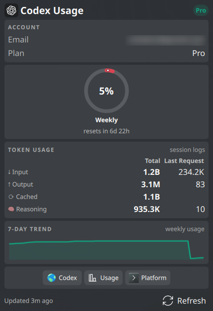

# Codex Usage Widget

A KDE Plasma 6 widget that displays your OpenAI Codex CLI usage statistics in the taskbar.

> Unofficial project — not affiliated with or endorsed by OpenAI.



## Features

- **100% Local**: Reads rate-limit snapshots from Codex CLI session logs (`~/.codex/sessions/`) — no network calls, no API keys
  
- **Weekly & Secondary Limits**: Usage percentages with reset countdowns, straight from the Codex CLI's own `rate_limits` data
- **Time-Proportional Coloring**: Colors based on elapsed time vs usage ratio (configurable, can switch to fixed thresholds)
- **Card Popup**: Modern card-based popup with configurable card order and visibility
  - Account info (email + plan from `auth.json`), usage ring, token stats (input/output/cached/reasoning), 7-day trend chart, quick links
- **Classic Popup**: Traditional layout with progress bars (switchable in settings)
- **Panel Styles**: Icon with usage badge, rings, or text — with a choice of ChatGPT or OpenAI icon
- **Desktop Notifications**: Alerts when usage crosses thresholds
- **Update Checker**: Dot on the panel icon when a new Codex CLI version is available
- **Process Visibility**: Hide widget or usage when Codex is not running
- **Configurable Refresh**: Adjustable polling interval
- **Local Cache**: Remembers last data on restart
- **Stale Detection**: Widget dims when data is outdated
- **Configurable Background Opacity**: Adjustable transparency for desktop placement
- **15 Languages**: EN, HU, DE, FR, ES, IT, PT, RU, PL, NL, TR, JA, KO, ZH-CN, ZH-TW
- **No Dependencies**: Pure QML + POSIX shell, no Python or external tools required

## Requirements

- KDE Plasma 6.0 or later
- [OpenAI Codex CLI](https://github.com/openai/codex) installed and logged in

## Installation

### Manual Installation

```bash
kpackagetool6 -t Plasma/Applet -i codex-usage-widget.plasmoid
```

### From Source

```bash
git clone https://github.com/izll/plasma-codex-usage.git
cd plasma-codex-usage
./install.sh
```

## Usage

1. Make sure you're logged in to Codex CLI (run `codex` in a terminal at least once)
2. Add the widget to your panel: right-click panel → "Add Widgets..." → search for "Codex Usage"
3. The widget reads the latest rate-limit snapshot from your local session logs and refreshes periodically

## How It Works

The Codex CLI writes a `rate_limits` snapshot into its session logs (`~/.codex/sessions/*.jsonl`) with every request. The widget tails the most recent logs and displays the latest snapshot — so the data is exactly what the CLI itself last saw, with zero extra API traffic. Account email and plan are read locally from `~/.codex/auth.json`.

## Related

- [Claude Usage Widget](https://github.com/izll/plasma-claude-usage) — the same concept for Claude Code

## License

GPL-3.0-or-later
